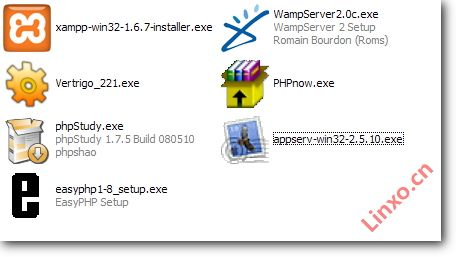

#HTML之"偷懒的HTML-coder"

##1.zencoding/emmet

* 初始化  
    * HTML文档需要包含一些固定的标签，比如<html>、<head>、<body>等，现在你只需要1秒钟就可以输入这些标签。比如输入`!` 或者 `html:5`，然后按Tab键： 
    * 
* 轻松添加类、id、文本和属性
    * 连续输入元素名称和ID，Emmet会自动为你补全，比如输入p#foo： 
    * 
    * 你可以通过输入h1{foo}和a[href=#]，定义HTML元素的内容和属性。
    * 
* 嵌套
    * >：子元素符号，表示嵌套的元素
    * +：同级标签符号
    * ^：可以使该符号前的标签提升一行
    * 
* 分组
    * 
* 定义多个元素
    * 
* 组合使用   
    * `.main>ul>.item[data-id=$]{item$}*4`
    
##2.markdown
一种适用于网络书写的轻量级标记语言 
* [http://www.jianshu.com/p/1e402922ee32/](http://www.jianshu.com/p/1e402922ee32/)
* markdown的编译和扩展 [马克飞象](http://maxiang.info/)
    
##3.jade
[jade](http://jade-lang.com/)

* Demo: [source/jade.jade](source/jade.jade)
* Demo: [source/js-tmpl.html](source/js-tmpl.html)

##Server Page (JSP/PHP/ASP)
1. JSP (Java Server Page)
    * 安装JDK/jre & Tomcat
    * Tomcat 基本目录介绍和配置
    * JSP入门
2. PHP
    * 支持php的服务器环境(apache+php,nginx+php,phpnow.etc)
    * 
    * windows下简单php服务器
    * php基本语法
3. ASP
    * 支持asp的服务器环境(IIS)
    * 简单asp服务器
    * asp基本语法
4. XAMPP

#HTML的"旅行"
##从服务端创建到客户端展现的过程
* 请求(Request) 
* 响应(Response)
* Socket
* 服务端处理过程
* 请求代理
##[HTTP Code]
* 20x: good
* 30x: server-modify
* 40x: no-access or no-resource
* 50x: error in server
##GET & POST
* 发起方式
* 参数获取/编码问题/长度问题
* 服务端接收模式 
##[URL编码]
* 解决GET请求中编码问题
* 解决网页中显示特殊字符等问题
##浏览器工作原理 
[http://www.iefans.net/liulanqi-ruhe-gongzuo-yuanli/](http://www.iefans.net/liulanqi-ruhe-gongzuo-yuanli/)
* 获取服务端响应开始
* 解析响应头, 确定解析模式, text/html 时进行HTML解析
* 解析html以构建dom树->构建render树->布局render树->绘制render树
* 。。。
